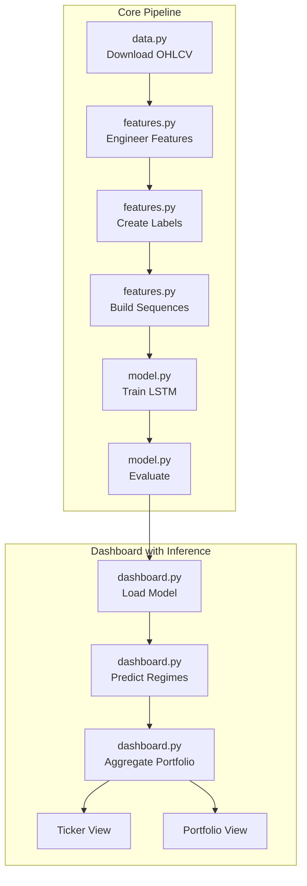

# LSTM Portfolio Risk Assistant - Simplified Architecture Plan

## Project Configuration

| Setting           | Value                                                                               |
| ----------------- | ----------------------------------------------------------------------------------- |
| US ETFs           | SPY, QQQ, VTI                                                                       |
| Malaysian Stocks  | 1155.KL (Maybank), 5347.KL (Public Bank), 5225.KL (Tenaga Nasional), 1023.KL (CIMB) |
| ML Framework      | Keras (TensorFlow)                                                                  |
| Dashboard         | Streamlit                                                                           |
| Prediction Target | 5-day volatility regime (low/medium/high)                                           |
| Sequence Length   | 30 trading days                                                                     |
| Data History      | 5-10 years where available                                                          |

---

## 1. Simplified Project Structure (5 Core Files)

```
LSTM Portfolio Risk Assistant/
├── config.py                 # All configuration constants
├── data.py                   # Data download and preprocessing
├── features.py               # Feature engineering + labels + sequences
├── model.py                  # LSTM model + training + evaluation
├── dashboard.py              # Streamlit UI + inference + portfolio aggregation
├── main.py                   # Entry point for training
├── requirements.txt
├── README.md
├── data/                     # Data storage
│   ├── raw/                  # Downloaded CSV files
│   └── processed/            # Feature datasets
├── models/                   # Saved trained models
└── notebooks/                # Jupyter notebooks for exploration
    └── exploration.ipynb
```

**Reduction**: From 20+ files to **5 core Python files** + main entry point

---

## 2. Architecture Diagram



---

## 3. Module Specifications

### 3.1 Configuration - [`config.py`](config.py)

```python
# All constants in one place
TICKERS = {
    'us_etfs': ['SPY', 'QQQ', 'VTI'],
    'my_stocks': ['1155.KL', '5347.KL', '5225.KL', '1023.KL']
}
ALL_TICKERS = TICKERS['us_etfs'] + TICKERS['my_stocks']

# Data
DATA_DIR = 'data/raw'
PROCESSED_DIR = 'data/processed'
MODELS_DIR = 'models'
YEARS_OF_DATA = 10

# Features
SEQUENCE_LENGTH = 30
VOLATILITY_WINDOWS = [5, 10, 20]
RSI_WINDOW = 14

# Labels
PREDICTION_HORIZON = 5  # days
REGIME_CLASSES = ['low', 'medium', 'high']

# Model
LSTM_UNITS = [64, 32]
DROPOUT_RATE = 0.2
EPOCHS = 100
BATCH_SIZE = 32
PATIENCE = 10
LEARNING_RATE = 0.001

# Train/val/test split
TRAIN_RATIO = 0.7
VAL_RATIO = 0.15
TEST_RATIO = 0.15
```

### 3.2 Data Module - [`data.py`](data.py)

**Purpose**: Download and manage OHLCV data

```python
# Key functions:
def download_data(tickers, years=10):
    """Download data for all tickers using yfinance"""

def load_data(ticker):
    """Load data from CSV"""

def save_data(df, ticker):
    """Save data to CSV"""

# Output: CSV files in data/raw/{ticker}.csv
# Columns: Date, Open, High, Low, Close, Volume
```

### 3.3 Features Module - [`features.py`](features.py)

**Purpose**: All feature engineering and label construction

```python
# Feature Engineering
def compute_log_returns(prices):
    """Daily log returns"""

def compute_rolling_volatility(returns, windows):
    """Rolling std for multiple windows"""

def compute_rsi(prices, window=14):
    """Relative Strength Index"""

def compute_moving_averages(prices, windows):
    """Simple moving averages"""

def build_features(df):
    """Build all features for a ticker"""
    # Returns: DataFrame with 15-20 features

# Label Construction
def compute_future_volatility(returns, horizon=5):
    """Realized volatility over next N days"""

def create_regime_labels(volatility):
    """Bucket into low/medium/high using tertiles"""

def prepare_dataset(ticker):
    """Load data, build features, add labels"""
    # Returns: DataFrame with features + regime_label

# Sequence Building
def build_sequences(features, labels, seq_length=30):
    """Create sliding window sequences"""
    # Returns: X (n_samples, seq_length, n_features), y (n_samples,)

def prepare_all_data(tickers):
    """Prepare sequences for all tickers"""
    # Returns: X_train, X_val, X_test, y_train, y_val, y_test, scaler
```

### 3.4 Model Module - [`model.py`](model.py)

**Purpose**: LSTM architecture, training, and evaluation

```python
# Model Architecture
def build_lstm_model(input_shape, n_classes=3):
    """
    LSTM model:
    - Input: (batch, 30, n_features)
    - LSTM 64 units -> Dropout 0.2
    - LSTM 32 units -> Dropout 0.2
    - Dense 16 -> Output 3 (softmax)
    """

def build_baseline_models():
    """Create baseline models for comparison"""
    # - MajorityClassBaseline
    # - RuleBasedBaseline (recent volatility thresholds)
    # - RandomForestBaseline

# Training
def train_model(model, X_train, y_train, X_val, y_val, callbacks):
    """Train with early stopping"""

def get_callbacks():
    """Early stopping, model checkpoint, reduce LR"""

# Evaluation
def evaluate_model(model, X_test, y_test):
    """Compute accuracy, F1, confusion matrix"""

def compare_models(lstm_model, baselines, X_test, y_test):
    """Compare LSTM vs baselines"""

def save_model(model, path):
    """Save trained model"""

def load_model(path):
    """Load trained model"""
```

### 3.5 Dashboard Module - [`dashboard.py`](dashboard.py)

**Purpose**: Streamlit UI + inference + portfolio aggregation (combined)

```python
import streamlit as st
from model import load_model
from features import build_features, prepare_dataset
from config import ALL_TICKERS, REGIME_CLASSES

# Inference Functions (moved from predict.py)
def get_latest_sequence(ticker, scaler):
    """Build sequence from most recent data"""

def predict_regime(model, sequence):
    """Get regime probabilities for one ticker"""
    # Returns: {'regime': 'medium', 'probabilities': {...}}

def predict_all_tickers(model, tickers, scaler):
    """Predict for all tickers"""
    # Returns: Dict[ticker, prediction]

def compute_portfolio_risk(predictions, weights):
    """Aggregate portfolio risk"""
    # Returns: {
    #     'portfolio_regime': 'medium',
    #     'risk_score': 0.35,
    #     'high_risk_weight': 0.30,
    #     'summary': 'Portfolio currently in medium risk...'
    # }

# Dashboard UI
def main():
    st.title("LSTM Portfolio Risk Assistant")

    # Load model once
    model = load_model('models/lstm_regime.h5')

    tab1, tab2 = st.tabs(["Ticker View", "Portfolio View"])

    with tab1:
        # Ticker selection
        ticker = st.selectbox("Select Ticker", ALL_TICKERS)

        # Get prediction
        prediction = predict_regime(model, ticker)

        # Display price chart with regime bands
        # Display current regime + probabilities

    with tab2:
        # Portfolio weights input (sliders)
        weights = {}
        for ticker in ALL_TICKERS:
            weights[ticker] = st.slider(f"{ticker} weight", 0, 100, 14)

        # Get all predictions
        predictions = predict_all_tickers(model, ALL_TICKERS)

        # Compute portfolio risk
        portfolio_risk = compute_portfolio_risk(predictions, weights)

        # Display risk summary table
        # Display aggregated risk score
        # Display text summary

if __name__ == "__main__":
    main()
```

### 3.6 Main Entry Point - [`main.py`](main.py)

```python
from config import ALL_TICKERS
from data import download_data
from features import prepare_all_data
from model import build_lstm_model, train_model, evaluate_model, save_model

def main():
    """Full training pipeline"""
    st.title("LSTM Portfolio Risk Assistant - Training")

    # 1. Download data
    print("Downloading data...")
    download_data(ALL_TICKERS, years=10)

    # 2. Build features and labels
    print("Building features and labels...")
    X_train, X_val, X_test, y_train, y_val, y_test, scaler = prepare_all_data(ALL_TICKERS)

    # 3. Build model
    print("Building LSTM model...")
    model = build_lstm_model(input_shape=(X_train.shape[1], X_train.shape[2]))

    # 4. Train
    print("Training...")
    history = train_model(model, X_train, y_train, X_val, y_val)

    # 5. Evaluate
    print("Evaluating...")
    metrics = evaluate_model(model, X_test, y_test)
    print(f"Test Accuracy: {metrics['accuracy']:.2%}")

    # 6. Save
    save_model(model, 'models/lstm_regime.h5')
    print("Model saved!")

if __name__ == "__main__":
    main()
```

---

## 4. Dashboard Design

### Tab 1: Ticker View

```
┌─────────────────────────────────────────────────────────────┐
│  Select Ticker: [SPY ▼]                                     │
├─────────────────────────────────────────────────────────────┤
│                                                             │
│  ┌─────────────────────────────────────────────────────┐   │
│  │         PRICE CHART WITH REGIME BANDS               │   │
│  │  (Line chart with colored background by regime)     │   │
│  └─────────────────────────────────────────────────────┘   │
│                                                             │
│  Current Regime: MEDIUM                                     │
│  Probabilities: Low: 15% | Medium: 55% | High: 30%         │
│                                                             │
└─────────────────────────────────────────────────────────────┘
```

### Tab 2: Portfolio View

```
┌─────────────────────────────────────────────────────────────┐
│  Portfolio Weights (adjust sliders):                        │
│  SPY: [30%]  QQQ: [20%]  VTI: [15%]                        │
│  1155.KL: [15%]  5347.KL: [10%]  5225.KL: [5%]  1023.KL: [5%] │
├─────────────────────────────────────────────────────────────┤
│                                                             │
│  Portfolio Risk: MEDIUM  |  Risk Score: 0.35               │
│                                                             │
│  ┌─────────────────────────────────────────────────────┐   │
│  │  Ticker    Weight    Regime    High-Risk Prob       │   │
│  │  SPY       30%       Medium    25%                  │   │
│  │  QQQ       20%       High      60%                  │   │
│  │  ...       ...       ...       ...                  │   │
│  └─────────────────────────────────────────────────────┘   │
│                                                             │
│  Summary: Portfolio in medium risk regime.                  │
│  35% of weight in high-risk assets.                        │
│                                                             │
└─────────────────────────────────────────────────────────────┘
```

---

## 5. Implementation Phases

### Phase 1: Data & Features

1. Create `config.py` with all constants
2. Create `data.py` for data download
3. Create `features.py` for feature engineering + labels + sequences
4. Test with one ticker

### Phase 2: Model

1. Create `model.py` with LSTM architecture
2. Add training pipeline
3. Add baseline models
4. Add evaluation
5. Create `main.py` entry point
6. Train and evaluate

### Phase 3: Dashboard

1. Create `dashboard.py` with Streamlit
2. Add inference functions
3. Implement ticker view
4. Implement portfolio view
5. Connect to trained model

### Phase 4: Polish

1. Create `requirements.txt`
2. Write `README.md`
3. Test end-to-end
4. Clean up code

---

## 6. Dependencies

```
# requirements.txt
yfinance>=0.2.0
pandas>=2.0.0
numpy>=1.24.0
tensorflow>=2.13.0
scikit-learn>=1.3.0
streamlit>=1.28.0
plotly>=5.18.0
matplotlib>=3.7.0
```

---

## 7. Final Todo List

| #   | Task                                 | File             |
| --- | ------------------------------------ | ---------------- |
| 1   | Create config.py                     | config.py        |
| 2   | Create data.py                       | data.py          |
| 3   | Create features.py                   | features.py      |
| 4   | Create model.py                      | model.py         |
| 5   | Create main.py                       | main.py          |
| 6   | Create dashboard.py (with inference) | dashboard.py     |
| 7   | Create requirements.txt              | requirements.txt |
| 8   | Write README.md                      | README.md        |
| 9   | Test end-to-end                      | -                |

---

## 8. Success Criteria

1. **Model**: LSTM beats baselines (>55% accuracy on test set)
2. **Dashboard**: Loads in <5 seconds, shows clear regime predictions
3. **Code**: 5 core files, easy to understand and modify
4. **Documentation**: README explains setup and usage

---

## Next Steps

After approval:

1. Switch to Code mode
2. Implement files in order: config → data → features → model → main → dashboard
3. Test each module before moving to next
